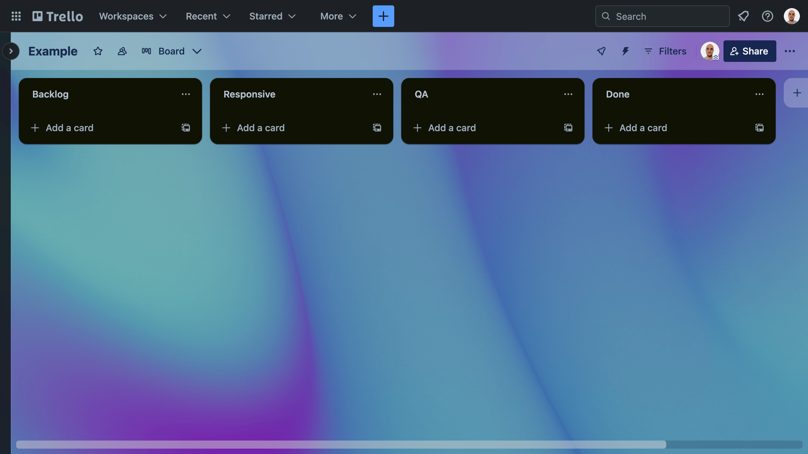

See Trello board example [here](https://trello.com/invite/b/7i5M1ZMV/ATTI118b7813c28e2dfedcaa7caaaab596fd00C1A96A/example).

Firstly, after creating a board, we'll make four lists: **Backlog**, **Responsive**, **QA** and **Done**. Initially, I populate the backlog list with all the tasks required to complete the project, in order of completion, then I'll drag them from left to right until they're in the done list.

Note, I only ever work on one task at a time, which is always the card on top of either the backlog, responsive or QA list. This allows me to stay focused and keeps your Git commits logical.

Moreover, the Responsive and QA lists are reserved for any development related tasks such as coding ACF blocks. For instance, since I code Desktop first, after finishing desktop styling on an ACF block, I place it in the responsive column. Then, once I've made it responsive, I place it in the QA column, where I test it on all modern browsers. 

What's more, I like to add a screenshot of the block from the designs, so when the client reviews Trello, they have a good indicator of the progress of the project.

Also, I normally break down the task further in each card with a checklist, especially when it's a complicated one. It may seem verbose, but since distractions are inevitable these days, it ensures you know exactly where you are when you get back to work.

Next I'll cover the most common cards I create when developing a theme. First up is Setup, here I create my local WordPress instance using Local by flywheel, GitHub repo to store the theme code and implement the style guide that's been provided on the designs.

<iframe src="https://player.vimeo.com/video/905799820?badge=0&autopause=0&player_id=0&app_id=58479&autoplay=1&controls=0&loop=1&muted=1" title="Creating a card in trello" class="w-full aspect-video"></iframe>

Following that, I scan through the designs for any 'Partials'. These are singular elements that are used often throughout the site, such as buttons. After this, I create cards for global content such as the header and footer.

I then scan through the designs once more and create a card for any unique block. Common examples include a hero, two column, form and list. These will all be coded as ACF Pro blocks.

Animation is next. I refer to the designs and list any that are mentioned. These normally include hover effects on links and buttons and fading in the blocks as you scroll.

Finally, optimization. Here I double-check that all images are being lazy loaded and all assets such as CSS and JS are fully minified, ready for production.

The below screen recording illustrates what your Trello board should look like.

<iframe src="https://player.vimeo.com/video/905799839?badge=0&autopause=0&player_id=0&app_id=58479&autoplay=1&controls=0&loop=1&muted=1" title="Populated Trello board"></iframe>
